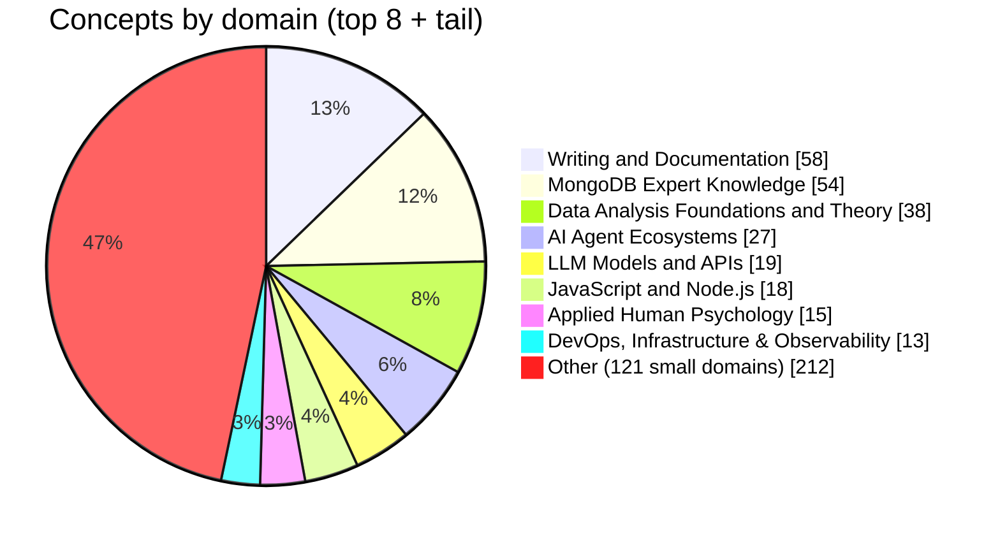
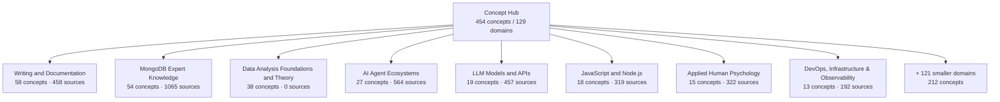
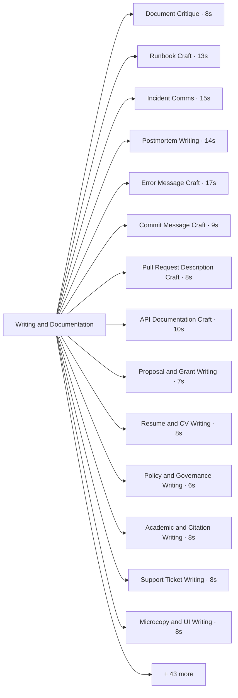
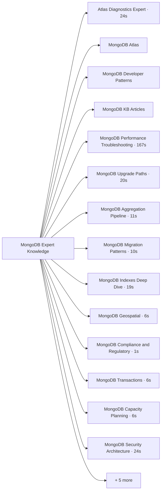
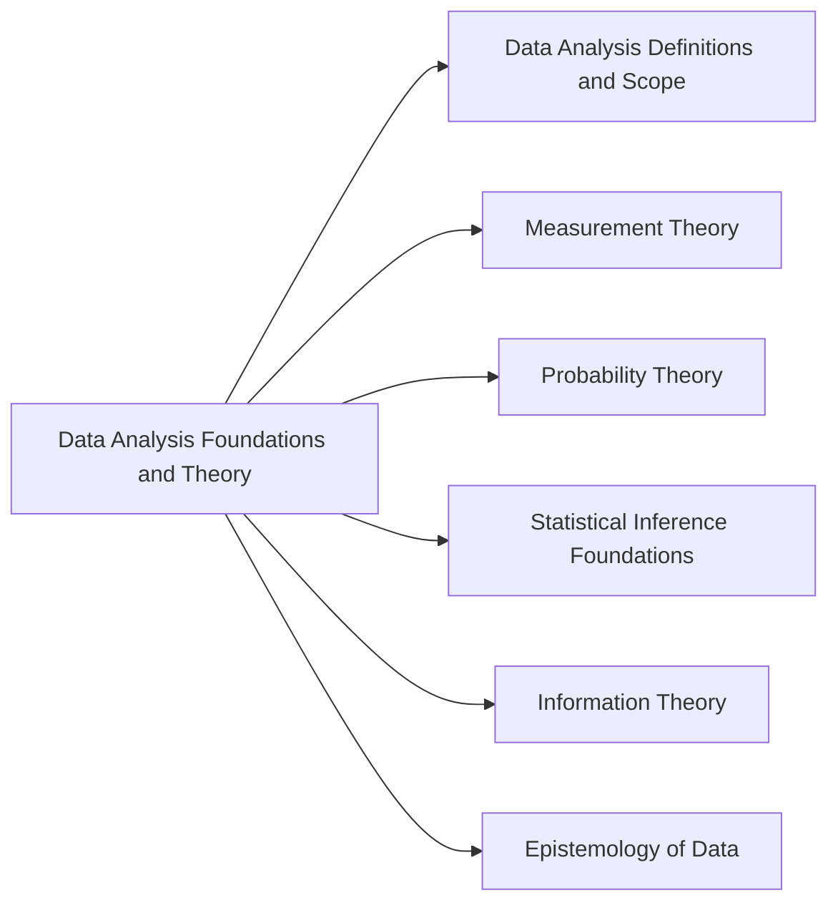

<!-- GENERATED by scripts/build-concept-tree-viz.mjs - do not edit by hand. Re-run the generator. -->
<!-- Source: concept-tree/tree.json. NOT part of `npm run sync:skills`. -->

# Concept Tree — Visualization

_Generated 2026-06-20T03:46:05.157Z from `concept-tree/tree.json` (as-of 2026-06-02)._

For the interactive version (radial tree, treemap, charts) open **[`concept-tree.html`](./concept-tree.html)** in a browser — it is self-contained and works offline.

For an interactive **3D mind map** (rotate/zoom, click a node to isolate its linked neighbors and see the concept's details + skill description) open **[`concept-tree-3d.html`](./concept-tree-3d.html)**.

## What the tree looks like

- **454 concept nodes** across **129 top-level groups** (1 malformed node(s) filtered).
- Those 129 groups = **76 true roots** (`parentConcept: null`) + **53 fragments** whose `parentConcept` names a node that does not exist (dangling: `Blockchain protocols`, `FSI Banking Industry and Regulatory Context`, `Human Psychology`, `Programming Languages`, `Python Patterns and Best Practices`, `Software Engineering &amp; Distributed Computing`, …). The true family count is lower than 119 — e.g. **MongoDB Atlas** (?) shows up split from **MongoDB Expert Knowledge** because Atlas's parent points to `MongoDB` rather than the actual root node name. Surfacing that dangling-edge gap is itself a result of visualizing the tree.
- **7381 research sources** total; the largest domain is **Writing and Documentation** (58 concepts).
- **23% of concepts (104)** carry **zero** recorded sources — structural/placeholder nodes awaiting a research pass.
- Research is tightly clustered in time (2026-05-25 → 2026-06-20); **377** concepts have been refreshed, **0** are stale (>90d).

## Domain sizes

## Domain map

## Drill-down: the three largest domains

### Writing and Documentation (58 concepts · 458 sources)

### MongoDB Expert Knowledge (54 concepts · 1065 sources)

### Data Analysis Foundations and Theory (38 concepts · 0 sources)

## Research depth — top 15 concepts by sources

_Encoding: rank-ordered table; `sources` is the magnitude measure._

| Rank | Concept | Domain | Sources |
|---:|---|---|---:|
| 1 | MongoDB Performance Troubleshooting | MongoDB Expert Knowledge | 167 |
| 2 | Software Architecture | Software Architecture | 167 |
| 3 | HTML and CSS | Frontend Design | 150 |
| 4 | Elasticsearch / OpenSearch and the ELK Elastic Stack | Elasticsearch / OpenSearch and the ELK Elastic Stack | 145 |
| 5 | MongoDB Expert Knowledge | MongoDB Expert Knowledge | 139 |
| 6 | JavaScript and Node.js | JavaScript and Node.js | 131 |
| 7 | Code Review | Code Review | 117 |
| 8 | Performance Profiling Expert | Performance Profiling Expert | 112 |
| 9 | Accessibility and UX Review | Frontend Design | 109 |
| 10 | Splunk Platform and SPL (Search Processing Language) | Splunk Platform and SPL (Search Processing Language) | 108 |
| 11 | Testing and Vitest Expert | Testing and Vitest Expert | 105 |
| 12 | TypeScript Expert | TypeScript Expert | 105 |
| 13 | Security Review | Security Review | 93 |
| 14 | Distributed Systems & Consensus (theory + blockchain mechanisms) | Distributed Systems & Consensus (theory + blockchain mechanisms) | 90 |
| 15 | Bitcoin protocol and ecosystem | Bitcoin protocol and ecosystem | 75 |

## How this was built

Run `node scripts/build-concept-tree-viz.mjs`. The generator reads `tree.json`, walks `parentConcept` pointers to assign each concept a root domain, rolls up magnitude (`sourcesCount`) and recency (`researchedAt`/`refreshedAt`), and emits this file plus the interactive `concept-tree.html`.
